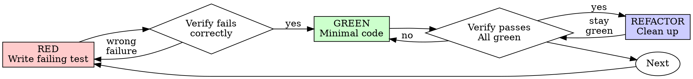

# Test-Driven Development (TDD)

## Overview

Write the test first. Watch it fail. Write minimal code to pass.

**Core principle:** If you didn't watch the test fail, you don't know if it tests the right thing.

**Violating the letter of the rules is violating the spirit of the rules.**

## When to Use

**Always:**
- New features
- Bug fixes
- Refactoring
- Behavior changes

**Exceptions (ask your human partner):**
- Throwaway prototypes
- Generated code
- Configuration files

Thinking "skip TDD just this once"? Stop. That's rationalization.

## The Unbreakable Bar (NEVER Lower the Test Standard)

```
ELEVATE THE CODE TO PASS THE TEST — NEVER LOWER THE BAR OF THE TEST ITSELF
```

When a test fails:
1. **Fix the actual production logic and root cause.**
2. **STRICTLY FORBIDDEN:**
   - Never soften specific assertions to loose checks (e.g. replacing `expect(x).toEqual(specific)` with `expect(x).toBeDefined()` or `expect(typeof x).toBe("object")`).
   - Never delete, comment out, or bypass failing test cases to get a cheap green check.
   - Never weaken error branch validations or contract checks.
   - Never write shallow "pass-through" tests that merely execute a function without asserting meaningful boundary behavior.

If the test caught a bug, the test did its job. Celebrate the catch and fix the code.

## The Iron Law of AI & Generated Output Testing (MANDATORY)

```
NEVER TEST AI RESPONSE CONTENT, CLASSNAMES, CSS STYLES, OR HTML MARKUP
```

In AI-powered generation engines, unit and TDD tests MUST NOT assert:
- AI model answer wording or prose
- Exact `className` strings or Tailwind utility lists
- HTML tag names, DOM trees, or section sequence
- CSS rules, color hexes, OKLCH strings, or style declarations
- Generated source snapshots

**What tests DO assert (Deterministic Mechanical Invariants Only):**
1. **JSON Schemas & Types**: Zod schema parsing, data structures, required keys (`ok: true`, `error: ...`).
2. **Type Narrowing**: Type safety, boundaries, error cases, null handling.
3. **Hard Boundaries**: Action URLs, route topology, package policies, security permissions, compilation.

Testing markup, styling, or prose forces rigid, template-ish AI output. Default styling belongs in static starter scaffolds, not in string-matching test assertions. Visual and aesthetic appeal belongs strictly to human visual inspection.

## The Iron Law

```
NO PRODUCTION CODE WITHOUT A FAILING TEST FIRST
```

Write code before the test? Delete it. Start over.

**No exceptions:**
- Don't keep it as "reference"
- Don't "adapt" it while writing tests
- Don't look at it
- Delete means delete

Implement fresh from tests. Period.

## Red-Green-Refactor



### RED - Write Failing Test

Write one minimal test showing what should happen.

<Good>
```typescript
test('retries failed operations 3 times', async () => {
  let attempts = 0;
  const operation = () => {
    attempts++;
    if (attempts < 3) throw new Error('fail');
    return 'success';
  };

  const result = await retryOperation(operation);

  expect(result).toBe('success');
  expect(attempts).toBe(3);
});
```
Clear name, tests real behavior, one thing
</Good>

<Bad>
```typescript
test('retry works', async () => {
  const mock = jest.fn()
    .mockRejectedValueOnce(new Error())
    .mockRejectedValueOnce(new Error())
    .mockResolvedValueOnce('success');
  await retryOperation(mock);
  expect(mock).toHaveBeenCalledTimes(3);
});
```
Vague name, tests mock not code
</Bad>

**Requirements:**
- One behavior
- Clear name
- Real code (no mocks unless unavoidable)

### Verify RED - Watch It Fail

**MANDATORY. Never skip.**

```bash
bun test path/to/test.test.ts
```

Confirm:
- Test fails (not errors)
- Failure message is expected
- Fails because feature missing (not typos)

**Test passes?** You're testing existing behavior. Fix test.

**Test errors?** Fix error, re-run until it fails correctly.

### GREEN - Minimal Code

Write simplest code to pass the test.

<Good>
```typescript
async function retryOperation<T>(fn: () => Promise<T>): Promise<T> {
  for (let i = 0; i < 3; i++) {
    try {
      return await fn();
    } catch (e) {
      if (i === 2) throw e;
    }
  }
  throw new Error('unreachable');
}
```
Just enough to pass
</Good>

<Bad>
```typescript
async function retryOperation<T>(
  fn: () => Promise<T>,
  options?: {
    maxRetries?: number;
    backoff?: 'linear' | 'exponential';
    onRetry?: (attempt: number) => void;
  }
): Promise<T> {
  // YAGNI
}
```
Over-engineered
</Bad>

Don't add features, refactor other code, or "improve" beyond the test.

### Verify GREEN - Watch It Pass

**MANDATORY.**

```bash
bun test path/to/test.test.ts
```

Confirm:
- Test passes
- Other tests still pass
- Output pristine (no errors, warnings)

**Test fails?** Fix code, not test.

**Other tests fail?** Fix now.

### REFACTOR - Clean Up

After green only:
- Remove duplication
- Improve names
- Extract helpers

Keep tests green. Don't add behavior.

### Repeat

Next failing test for next feature.

---

## Writing High-Signal, Honest Tests

A test exists to catch a specific break. Two core principles govern all tests:

```
1. Every test names the break it catches
2. Every test exercises the real thing
```

### Principle 1: Name the Break

Before writing the test body, answer: **what production change should make this test fail — and is that change a bug or a decision?** A test earns its place by catching a wrong branch, missing side effect, wrong argument, boundary case, or broken contract.

**Derive expectations independently.** Use literals and hand-checked fixtures; table-driven tests with literal `want` values are the preferred shape. An expectation computed by the code under test — or its helpers — passes no matter what that code does:

```typescript
// ❌ Mirror assertion: the same builder computes both sides — always true
const expected = buildSearchQuery({ tag: 'urgent' });
expect(buildSearchQuery({ tag: 'urgent' })).toBe(expected);

// ✅ Hand-derived literal
expect(buildSearchQuery({ tag: 'urgent' })).toBe('tag:"urgent"');
```

**No change detectors.** If only intentional decisions can fail a test — a constant's value, exact message wording, private structure — it fires on redesign and sleeps through bugs. Test the behavior that depends on the decision: not `expect(MAX_RETRIES).toBe(5)` but "a failing call is retried 5 times and the 6th attempt never happens."

**Your code, not the framework.** Test the contract your code makes at its boundaries — the route you register, the query you emit, the payload you produce. Upstream mechanics belong to upstream test suites. Test constructors, getters, and forwarding only when they validate, normalize, default, derive, or cause side effects.

### Principle 2: Exercise the Real Thing

**The mock earns no assertions.** A mock assertion passes when the mock is present and fails when it is absent — it says nothing about the component. Assert the real component's behavior; if the mock is what you are checking, unmock it or delete the assertion.

**Mock at the right level.** Learn every side effect of the real method before replacing it; mock only the slow or external network/database boundary, and keep everything the test depends on real.

**Make doubles specific.** When arguments, call counts, or ordering are part of the contract, assert them — a fake that accepts anything verifies nothing. Give each branch (success, error, malformed) its own fixture or spy, so the wrong branch cannot satisfy the expectation.

---

## Common Rationalizations

| Excuse | Reality |
|--------|---------|
| "Too simple to test" | Simple code breaks. Test takes 30 seconds. |
| "I'll test after" | Tests written after pass immediately — which proves nothing. They verify the cases you remembered, not the ones you'd have discovered. |
| "Already manually tested" | Manual testing has no record, cannot re-run in CI, and misses edge cases under pressure. Automated tests run the same way every time. |
| "Deleting X hours is wasteful" | Sunk cost fallacy. Rewrite with TDD gives high confidence. Keeping code you cannot trust is the real waste. |
| "Keep as reference, write tests first" | You'll adapt it. That's testing after. Delete means delete. |
| "Lower the test assertion to pass CI" | Pure malpractice. When a test fails, elevate the production code. Never weaken assertions. |

## Red Flags - STOP and Start Over

- Code before test
- Test after implementation
- Test passes immediately on first run
- Softening an assertion (`toBeDefined`) to bypass a failure
- Asserting on AI prose, styling strings, or HTML trees
- Can't explain why test failed
- "TDD is dogmatic, I'm being pragmatic"

**All of these mean: Delete code. Start over with TDD.**

## Verification Checklist

Before marking work complete:

- [ ] Every new function/method has a colocated test
- [ ] Watched each test fail before implementing
- [ ] Each test failed for expected reason (feature missing, not typo)
- [ ] Wrote minimal code to pass each test
- [ ] Assertions test deterministic mechanical invariants (Zod, schemas, error boundaries)
- [ ] No assertions on stochastic AI prose, classNames, or HTML trees
- [ ] All tests pass cleanly without lowering any test standards
- [ ] Output pristine (no errors, warnings)
