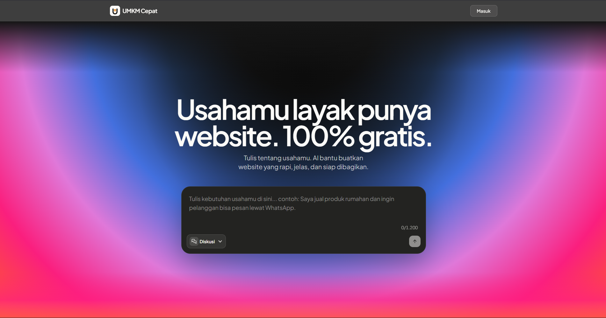

  

<h1 align="center">UMKM Cepat</h1>

  AI builder open-source untuk membantu UMKM Indonesia membuat website dan alat digital dari prompt sederhana.

  
  
  
  

## What is UMKM Cepat?

UMKM Cepat helps Indonesian small businesses turn plain Indonesian prompts into useful digital experiences. The product starts with fast website generation and is moving toward a custom frontend builder with guided discussion, real project previews, and exportable foundations.

The goal is practical: help sellers get a clean online presence without needing to understand design systems, routing, deployment, or AI tooling.

## Why this exists

Many Indonesian UMKM need better digital tools, but building them often requires time, budget, and technical support they do not have.

UMKM Cepat focuses on making creation easier:

- prompt-first building flow
- guided discussion before building
- practical business-focused output
- mobile-friendly user experiences
- Indonesian user-facing copy
- open-source, export-friendly foundations
- configurable AI providers through 9Router

## Current direction

UMKM Cepat is not meant to stop at fixed templates. The product direction is a Lovable-like builder for UMKM:

- Diskusi mode to clarify the business brief
- Buat mode to generate and preview the result
- generated frontend source as the next major foundation
- static/export-friendly output before database-heavy features
- full-stack generation later, with safer isolation and platform-owned modules first

## Tech overview

- Next.js 15 and React 19
- TypeScript
- Tailwind CSS and shadcn/ui-style owned components
- Prisma and PostgreSQL
- NextAuth Google OAuth
- Vercel AI SDK through 9Router
- Vitest, ESLint, Prettier, and Knip quality gates

## Contributing

Want to run the project locally or help build it?

Start with [CONTRIBUTING.md](CONTRIBUTING.md).

## License

MIT. See [LICENSE](LICENSE).
