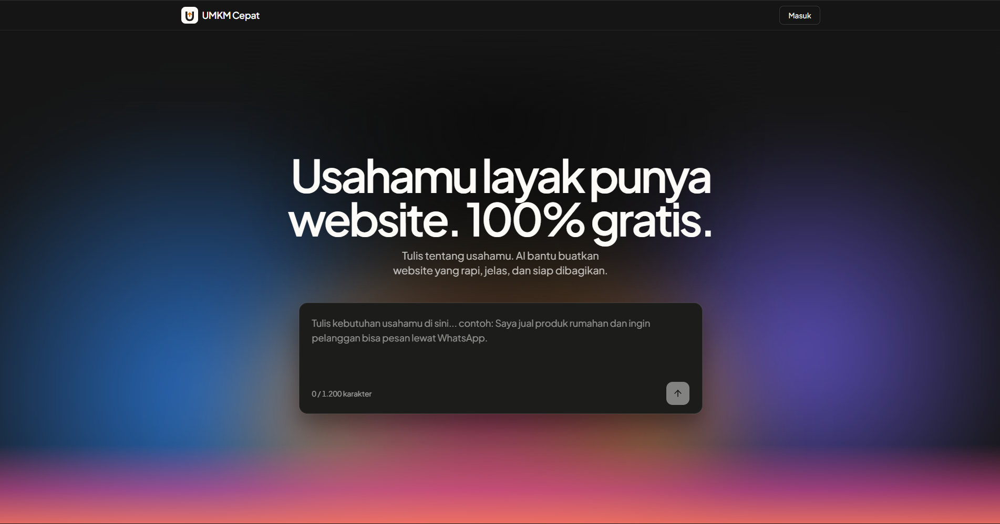

<p align="center">
  
</p>

<h1 align="center">UMKM Cepat</h1>

<p align="center">
  Website UMKM yang ketemu pembeli. Bikin website usaha gratis dalam 5 menit pakai AI — tanpa ngoding, siap dibagikan ke WhatsApp, gampang dicari pembeli.
</p>

<p align="center">
  <a href="https://github.com/suryaelidanto/umkmcepat/blob/main/LICENSE"></a>
  <a href="https://github.com/suryaelidanto/umkmcepat/pulls"></a>
</p>

## What is UMKM Cepat?

UMKM Cepat helps Indonesian small businesses turn plain Indonesian prompts into useful websites — the outcome is buyers, not just a website. The product is chat-first: users describe the business, AI clarifies the brief, then the workspace builds previewable frontend output. Photos attach in the chat; the vision-capable agent places them. Published sites are indexable landing pages (per-page SEO + sitemap + `LocalBusiness` schema). Free, R2-backed media, mobile-native.

The platform is 100% free for users — every feature is usable without paying. Approved pilot users receive a one-time 500,000 Energy grant with no automatic refill. Optional non-expiring Energy Boosters and manual pilot grants add more energy without locking features behind payment. Access is managed via a pilot whitelist with admin approval (targeting ~10 initial real UMKM businesses).

## Current direction

The goal: help an Indonesian UMKM owner make their first website — one that actually sells, and that they are proud to show people.

[ROADMAP.md](ROADMAP.md) has the vision, the ordered milestones, the honest gaps, and where to start if you want to help build it.

## Tech overview

- TanStack Start, TanStack Router, and Vite
- React 19 and TypeScript
- Tailwind CSS and owned shadcn/ui-style components
- Prisma and PostgreSQL
- Auth.js Google OAuth with Turnstile consent gate
- Vercel AI SDK through 9Router
- Vitest, ESLint, Prettier, TypeScript, and Knip

## Local development

```bash
bun install
cp .env.example .env
bun run infra
bun run db:migrate
bun run dev
```

`bun run infra` starts Postgres, Redis, 9Router, Headroom, and MinIO (local S3 dev mirror).

```text
App: http://localhost:3000
9Router: http://localhost:20129
```

Use `bun run infra:minimal` only when you need Postgres + Redis without AI/observability/storage services.

## Contributing

Start with [CONTRIBUTING.md](CONTRIBUTING.md).

## License

GNU Affero General Public License v3 (AGPLv3). See [LICENSE](LICENSE).
