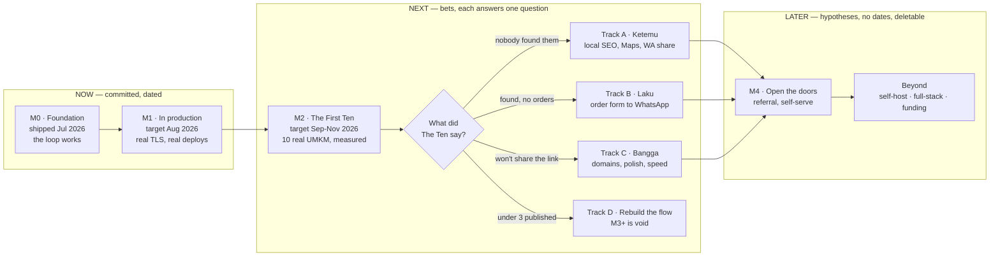

# Roadmap

Where UMKM Cepat is going, and why it's worth building. For setup and operating rules, see [`CONTRIBUTING.md`](CONTRIBUTING.md), [`DEV.md`](DEV.md), [`PRINCIPLES.md`](PRINCIPLES.md).

---

## The goal

**Help an Indonesian UMKM owner make their first website — one that actually sells, and that they are proud to show people.**

- **Sells** — brings buyers. A beautiful page nobody finds or acts on is a failure.
- **Proud** — the owner wants to send the link to their family WhatsApp group. Shame kills adoption faster than any missing feature.

When a decision is unclear, the tiebreaker is: does this get the owner closer to a site that sells, that they are proud of?

---

## The shape of the year

Only M1 has a date worth holding us to. Everything past M2 branches on what ten real business owners actually do.

## How much to trust each part

This roadmap gets **less certain the further out it goes**, on purpose.

| Horizon   | Meaning                                                        | Treat it as             |
| --------- | -------------------------------------------------------------- | ----------------------- |
| **Now**   | Committed. Dated. Has a "done means" bar you can check.        | A promise               |
| **Next**  | A bet. States the question it answers and what kills it.       | A direction, not a plan |
| **Later** | A hypothesis. May be promoted, rewritten, or deleted outright. | Thinking out loud       |

We have not run the pilot yet. **Nobody outside the maintainer has published a real site.** Writing a confident 12-month feature list today would be fiction, and it would break our own principle: _"Do unscalable learning before automating the workflow."_

---

## Why this matters

Indonesian UMKM are ~99% of businesses and ~56% of GDP, but only a few million of 65M+ are online. The barrier isn't price — it's whether the thing actually helps them find customers.

Free is what makes it _possible_. Useful is what makes it _happen_. We build for usefulness and give the product away.

## What we are building

A chat-first AI builder. The owner describes their business in plain Indonesian; the AI asks only what actually matters, then builds a real site they can preview, edit by pointing at it, and publish — no code, no designer, no waiting.

Free forever, every feature. Approved pilot users receive a one-time 500,000 Energy grant with no automatic refill. Optional non-expiring top-ups and manual pilot grants only add energy — they never lock functionality behind a paywall. We're proving this with a small pilot of real UMKM before opening the doors wider.

## What we will not build

So nobody sinks a weekend into a direction we can't merge:

- **No fake business content.** No invented prices, awards, addresses, stock, checkout. A lying UMKM site costs the owner their reputation.
- **No arbitrary backend code for users.** We add capability as built-in features everyone can trust, not a code sandbox anyone can exploit.
- **No lock-in.** What we generate belongs to the owner and stands on its own.
- **No generic AI-SaaS look.** No purple gradients, no glow, no badge soup. This has to feel calm and trustworthy, not like a template.

---

## The two numbers

The goal says "sells" and "proud." Those are unfalsifiable as adjectives, so we measure them. Every milestone below has to justify itself against these:

| Test               | Question                                                                                              | M2 target |
| ------------------ | ----------------------------------------------------------------------------------------------------- | --------- |
| **Laku** (sells)   | Of published pilot sites, how many brought **at least one real inbound customer contact** in 30 days? | ≥ 6 of 10 |
| **Bangga** (proud) | How many owners put the link somewhere public **without being asked** — WA bio, IG bio, status?       | ≥ 8 of 10 |

With ten users these are measured by asking and by looking. No analytics work required. That's the point — do the unscalable thing first.

If a proposed feature can't be argued to move one of these, it goes in Later or nowhere.

---

## Milestones

### M0 — Foundation ✅ shipped, July 2026

The core loop works, today, for real pilot users: describe your business, chat with the AI, get a real generated site, preview it, edit it by pointing at it or by chatting, upload photos and have the AI place them, and pick up where you left off.

Also shipped and load-bearing: ten business archetypes driving generation (F&B, retail, service, education, community, event, property, health, creative, agri), per-step energy metering with an itemized ledger, publishing with per-page SEO + sitemap + `LocalBusiness` schema, R2-backed media, a pilot waitlist with an admin dashboard, Pakasir payments for the Energy Booster, and Umami analytics.

### M1 — In production 🎯 target August 2026

**Now. Committed.** This is the only milestone with a date you should hold us to.

The product runs on the maintainer's laptop. It does not run on the internet. Nothing after this milestone is knowable until that changes.

**Done means:**

- The app serves real traffic over TLS from the VPS, behind Cloudflare Tunnel, with no inbound ports open.
- A merge to `main` builds, pushes, and deploys automatically — pinned to an immutable commit SHA, so rollback is a tag change.
- No critical advisories in production dependencies; the production image ships no devDependencies.
- HSTS and a `default-src` CSP are set on the control plane.
- The admin surface is safe to screen-share (streamer mode masks PII by default).

**Design and plans already written:**

- [`specs/2026-07-28-production-security-hardening-design.md`](docs/superpowers/specs/2026-07-28-production-security-hardening-design.md) — every finding verified against real code, not inferred.
- [Phase 1 · security correctness](docs/superpowers/plans/2026-07-28-prod-hardening-phase-1-security-correctness.md)
- [Phase 2 · image, headers, streaming `/edit`](docs/superpowers/plans/2026-07-28-prod-hardening-phase-2-image-headers-streaming.md)
- [Phase 3 · ingress and working CD](docs/superpowers/plans/2026-07-28-prod-hardening-phase-3-ingress-and-cd.md)
- [`specs/2026-07-28-streamer-mode-design.md`](docs/superpowers/specs/2026-07-28-streamer-mode-design.md)

Phases are strictly ordered: Phase 2's SSE conversion is a hard prerequisite for Phase 3, because Cloudflare terminates non-streaming requests at ~100s and `/edit` previously ran to 600s.

### M2 — The First Ten 🎯 target September–November 2026

**Next. A bet.**

> **The question this answers:** Can a real UMKM owner, without the maintainer sitting next to them, get to a published site they are proud of — and does that site bring them a customer?

Ten real Indonesian UMKM. Onboarded by hand, watched closely, supported over WhatsApp. Seeded with **service-sector businesses first** (jasa, home services, mobile food) — the research shows the highest digital-adoption propensity there, so it's the fastest honest signal.

**Done means:** 10 onboarded, and the Laku and Bangga numbers measured and written down — including if they're bad.

**What kills it:** if **fewer than 3 of 10 publish at all**, the builder flow is wrong and no feature fixes that. M3 is void; we go back to the flow itself (Track D). We would rather find that out at ten users than at ten thousand.

This milestone is deliberately unscalable. Do not automate onboarding here. Automation hides exactly the signal we're paying for.

### M3 — Answer The First Ten 🎯 target Q1 2027

**Next. A bet whose content does not exist yet.**

Five tracks are plausible. **At most two will happen.** Which two is decided by M2's numbers, not by preference — and the branch conditions are already written into the diagram above.

| Track                  | Runs if…                                | The question it answers                                           |
| ---------------------- | --------------------------------------- | ----------------------------------------------------------------- |
| **A · Ketemu** (found) | Sites publish, but nobody visits        | Does "sells" fail at **discovery** — local SEO, Maps, WA sharing? |
| **B · Laku** (sells)   | Visitors arrive, but nobody contacts    | Does it fail at the **ask** — order form to WhatsApp, catalog?    |
| **C · Bangga** (proud) | Owners publish but won't share the link | Is it the **URL and the polish** — custom domains, speed?         |
| **D · Rebuild**        | Under 3 of 10 published                 | The flow is broken. Everything else waits.                        |
| **E · Stay alive**     | Cost per published site is unbounded    | Can we afford the free tier at all?                               |

Track B is the most likely, and it has a constraint worth stating now: per _"What we will not build,"_ capability arrives as **built-in trustworthy features** (an order form that opens WhatsApp with a filled message), never as a user-writable code sandbox. Generated apps are static-frontend-only today by design. Any move past that is a deliberate architecture decision needing its own spec, not a feature request.

### M4 — Open the doors 🔮 2027, hypothesis

**Later. Delete this if M2 says the product isn't ready.**

> **The question:** Can this grow without the maintainer hand-holding every user?

Candidate shape, drawn from the research: waitlist as a real product surface with queue position and referral links (Dropbox-shape, +60% signups), two invite codes per admitted pilot member (Clubhouse-shape), and a free WhatsApp community of pemilik UMKM before any upsell (community-led, value-first).

**Hard gate:** we do not open the doors until **cost per published site is measured and bounded.** _"Stay default alive; do not build plans that require infinite money, attention, or users."_ If the subsidy can't be bounded, we cap the pilot rather than scale it. That is an acceptable outcome, not a failure.

### Beyond — hypotheses only 🔮

No dates. No promises. Listed so contributors know these are _thought about_, not _planned_. Each needs a spec and an argument against the two numbers before it becomes real.

- **A real self-hosting story.** The repo is AGPLv3 and public. `docker-compose.prod.yml` and `docs/superpowers/plans/` document _our_ VPS deploy — it is not a path anyone else has ever walked, and no independent instance has ever been stood up.
- **Generated apps beyond static frontend.** `PRODUCT.md` says "full-stack customer-facing web apps"; static-only is present scope. That gap is real and unresolved — it will be closed by a decision, in a spec, not by drift.
- **Grant / CSR funding.** Gojek onboarded 100k+ SMEs funded by Facebook and PayPal; the government targeted 30M UMKM digital. The narrative and the funders both exist.
- **Marketplace adjacency.** UMKM already live on Shopee, Tokopedia, TikTok Shop, Instagram. Complement, don't compete.

---

## Want to help build this?

**Every surface is open to contribution** — infra, CI, security, performance, tests, accessibility, refactors, product UI, and AI generation and prompts. Nothing is fenced off.

What protects quality is not a closed surface, it's the **spec-first workflow** this repo already runs on:

1. **Small and obvious** — bug fix, test, a11y fix, doc correction, perf win: just open a PR into `dev`.
2. **Non-trivial** — new behavior, new UI, prompt or generation changes, architecture: **open an issue first, or write a design doc in `docs/superpowers/specs/`.** Agree the shape before writing code. Every milestone above followed this path; see the specs folder for ~36 worked examples of the expected depth.

This is how taste stays consistent without gatekeeping who is allowed to touch what. It also means your work gets merged instead of closed.

Start with [`CONTRIBUTING.md`](CONTRIBUTING.md) for setup, then look for [`good first issue`](https://github.com/suryaelidanto/umkmcepat/labels/good%20first%20issue) or [`ready-for-agent`](https://github.com/suryaelidanto/umkmcepat/labels/ready-for-agent).

Read before you build: [`PRINCIPLES.md`](PRINCIPLES.md) for the quality bar, [`PRODUCT.md`](PRODUCT.md) for positioning, [`DESIGN.md`](DESIGN.md) before any UI, and `docs/superpowers/specs/` + `docs/superpowers/plans/` before touching project, workspace, renderer, publishing, provider, storage, auth, or AI-gateway boundaries.

## How this file changes

- **The goal sentence is stable.** Everything else is negotiable.
- **Now** is a commitment. If a date slips, the date changes here and says why.
- **Next** items are bets. Each carries the question it answers and what would kill it. A bet that gets killed is marked killed — not quietly deleted.
- **Later** items are hypotheses and may be deleted without ceremony.
- This file is reviewed at the end of every milestone. M2's numbers rewrite M3 — that is the intended behavior, not a failure of planning.
